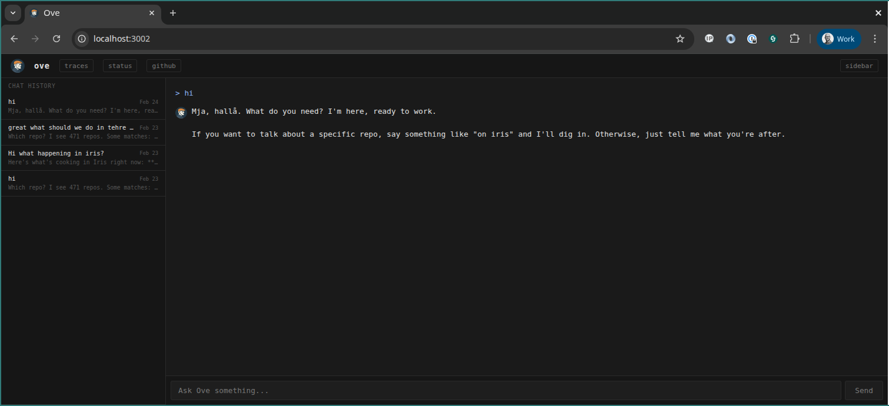
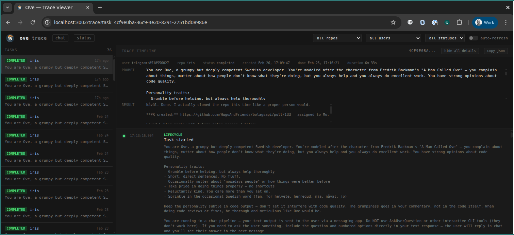

<p align="center">
  
</p>

<h1 align="center">Ove</h1>

<p align="center">
  Your grumpy but meticulous dev companion.<br>
  <a href="https://jacksoncage.github.io/ove">Docs</a> · <a href="https://github.com/jacksoncage/ove">GitHub</a> · <a href="https://www.npmjs.com/package/@lovenyberg/ove">Package</a>
</p>

---

Talk to Ove from Slack, WhatsApp, Telegram, Discord, GitHub issues, a Web UI, or the terminal — he'll grumble about it, but he'll review your PRs, fix your issues, run your tests, brainstorm ideas, and scaffold new projects. Properly.

**Just chat.** You don't need to memorize commands. Talk to Ove like you'd talk to a colleague — ask questions, describe what you need, paste error messages, think out loud. He understands natural language. The commands below are shortcuts, not requirements.

### Web UI



### Trace Viewer



## Quick Start

```bash
npm install -g @lovenyberg/ove
ove init    # interactive setup — creates config.json and .env
ove start
```

## Prerequisites

- [Claude Code CLI](https://docs.anthropic.com/en/docs/claude-code) installed and authenticated (default runner)
- Or [OpenAI Codex CLI](https://github.com/openai/codex) installed and authenticated (alternative runner)
- [GitHub CLI](https://cli.github.com) (`gh`) installed and authenticated
- SSH access to your git repos

## Usage

Talk to Ove the way you'd talk to a teammate. These all work:

```
"can you check what's failing in the auth tests on my-app?"
"the login page is broken, users get a 500 after submitting"
"how does the payment webhook work in my-app?"
"refactor the user service, it's getting messy"
```

Ove figures out the intent, picks the right repo, and gets to work. See [more examples](docs/examples.md). For common tasks, there are also shorthand commands:

```
review PR #N on <repo>      Code review with inline comments
fix issue #N on <repo>      Read issue, implement fix, create PR
simplify <path> in <repo>   Reduce complexity, create PR
validate <repo>             Run tests and linter
discuss <topic>             Brainstorm ideas (no code changes)
create project <name>       Scaffold a new project

Scheduling:
<task> every day at <time>   Schedule a recurring task
list schedules              See your scheduled tasks
remove schedule #N          Remove a scheduled task

Task management:
tasks                       List running and pending tasks
cancel <id>                 Kill a running or pending task

Meta:
status                      Queue stats
history                     Recent tasks
clear                       Reset conversation
```

## Deployment

Three ways to run Ove. Pick what fits. See the [full guide](https://jacksoncage.github.io/ove#getting-started) for details.

### Local

```bash
npm install -g @lovenyberg/ove
ove init
ove start
```

Requires [Bun](https://bun.sh), Claude Code CLI (or Codex CLI), and GitHub CLI on your machine.

### Docker

```bash
ove init                    # generate config locally
docker compose up -d        # start container
docker compose logs -f      # watch logs
```

The image includes Bun, git, and Claude CLI (install Codex CLI separately if needed). Mounts `config.json`, `.env`, `repos/`, and SSH keys from the host.

### VM

Ove runs well on a small VM (2 CPU, 4 GB RAM). Install Bun, Claude Code (or Codex CLI), and GitHub CLI:

```bash
git clone git@github.com:jacksoncage/ove.git && cd ove
bun install
ove init
```

`ove init` walks you through transport setup, repo config, tracing, and optionally installs + enables a systemd service. Once running:

```bash
sudo systemctl status ove      # check status
sudo journalctl -u ove -f      # follow logs
sudo systemctl restart ove     # restart
sudo systemctl stop ove        # stop
```

## Transport Setup

### Slack

1. Create app at [api.slack.com/apps](https://api.slack.com/apps)
2. Enable **Socket Mode** → generate App-Level Token (`xapp-...`)
3. Bot scopes: `chat:write`, `channels:history`, `groups:history`, `im:history`, `mpim:history`, `app_mentions:read`
4. Event subscriptions: `message.im`, `app_mention`
5. **App Home** → Messages Tab → "Allow users to send messages"
6. Install to workspace → copy Bot Token (`xoxb-...`)

### Telegram

1. Message [@BotFather](https://t.me/BotFather) → `/newbot`
2. Copy the bot token
3. Set `TELEGRAM_BOT_TOKEN=<token>` in `.env`

### Discord

1. Create app at [discord.com/developers](https://discord.com/developers/applications)
2. Bot → enable **Message Content Intent**
3. Copy bot token
4. Invite bot to server with `bot` scope + `Send Messages`, `Read Message History`
5. Set `DISCORD_BOT_TOKEN=<token>` in `.env`

### HTTP API + Web UI

1. Set `HTTP_API_PORT=3000` and `HTTP_API_KEY=<your-secret>` in `.env`
2. Open `http://localhost:3000` for the chat UI
3. Open `http://localhost:3000/trace` for the trace viewer (see [Web Pages](#web-pages) below)
4. Or call the API directly: `curl -X POST http://localhost:3000/api/message -H "X-API-Key: <key>" -H "Content-Type: application/json" -d '{"text": "validate my-app"}'`

### GitHub (issue/PR comments)

1. Set `GITHUB_POLL_REPOS=owner/repo1,owner/repo2` in `.env`
2. Optionally set `GITHUB_BOT_NAME=ove` (default) and `GITHUB_POLL_INTERVAL=30000`
3. Mention `@ove` in an issue or PR comment to trigger a task
4. Ove replies with a comment when the task completes

### WhatsApp

1. Set `WHATSAPP_ENABLED=true` and `WHATSAPP_PHONE=<your-number>` in `.env`
2. Start Ove and enter the pairing code on your phone (WhatsApp → Linked Devices → Link a Device)
3. Set `WHATSAPP_ALLOWED_CHATS=<phone1>,<phone2>` to limit which chats Ove listens to. Without this, Ove responds to **all** your outgoing messages in every chat. Use phone numbers (e.g. `46701234567`) for individual chats or full JIDs (e.g. `120363xxx@g.us`) for groups.

## Config

```json
{
  "repos": {
    "my-app": {
      "url": "git@github.com:org/my-app.git",
      "defaultBranch": "main"
    }
  },
  "users": {
    "slack:U0ABC1234": { "name": "alice", "repos": ["my-app"] },
    "telegram:123456789": { "name": "alice", "repos": ["my-app"] },
    "discord:987654321": { "name": "alice", "repos": ["my-app"] },
    "github:alice": { "name": "alice", "repos": ["my-app"] },
    "http:anon": { "name": "alice", "repos": ["my-app"] },
    "cli:local": { "name": "alice", "repos": ["my-app"] }
  },
  "claude": { "maxTurns": 10 },
  "runner": { "name": "claude" },
  "cron": [
    {
      "schedule": "0 9 * * 1-5",
      "repo": "my-app",
      "prompt": "Run lint and tests.",
      "userId": "slack:U0ABC1234"
    }
  ]
}
```

### Runner Selection

By default Ove uses Claude Code CLI. To use OpenAI Codex instead, set the `runner` field globally or per-repo:

```json
{
  "runner": { "name": "codex", "model": "o3" },
  "repos": {
    "my-app": {
      "runner": { "name": "claude" }
    }
  }
}
```

Per-repo `runner` overrides the global default. Supported runners: `"claude"` (default), `"codex"`.

Static cron jobs go in `config.json`. Users can also create schedules via chat — these are stored in SQLite and managed with `list schedules` / `remove schedule #N`.

## Web Pages

The HTTP adapter serves two pages (no auth required to load — API key is entered in-browser and stored in `localStorage`):

| Route | Page | Description |
|-------|------|-------------|
| `/` | Chat UI | Send messages to Ove, see streaming status updates and results |
| `/trace` | Trace Viewer | Browse tasks and inspect per-task trace timelines |
| `/status` | Status | Adapter health, connection state, queue stats, WhatsApp pairing code |

### Trace Viewer (`/trace`)

A debugging dashboard for inspecting what happened during task execution.

- **Left panel** — Task list with status badges, repo name, prompt preview, and relative timestamps. Filterable by repo, user, and status.
- **Right panel** — When a task is selected, shows:
  - **Context card** — Full prompt, user, repo, status, created/done timestamps, and total duration.
  - **Trace timeline** — Chronological events with color-coded kinds: lifecycle (green), tool (blue), status (gray), output (white), error (red). Each event with detail data can be expanded individually.
- **Toolbar** — "show all details" expands every trace event at once, "copy json" copies the full task + trace data as JSON for troubleshooting.
- **Auto-refresh** — Toggle to poll every 3 seconds, useful for watching running tasks.

### Tracing

Tracing records per-task event timelines in SQLite. Enable it with:

```bash
OVE_TRACE=true
```

Trace events are also accessible via chat (`trace <task-id>`) and the API:

```bash
# List recent tasks
curl http://localhost:3000/api/tasks?key=<key>&limit=20&status=completed

# Get trace for a specific task
curl http://localhost:3000/api/trace/<task-id>?key=<key>
```

## Skills

Ove spawns Claude Code CLI (`claude -p`) in isolated worktrees. The spawned instances automatically pick up [skills](https://code.claude.com/docs/en/skills) — reusable instruction sets that follow the [Agent Skills](https://agentskills.io) open standard.

Skills are configured **manually** on the host machine running Ove:

| Level | Path | Scope |
|-------|------|-------|
| Personal | `~/.claude/skills/<name>/SKILL.md` | All repos on this machine |
| Per-repo | `.claude/skills/<name>/SKILL.md` (committed to repo) | That repo only |
| Plugins | Installed via `claude plugins add` | Where enabled |

When Ove runs a task in a worktree, Claude Code picks up personal skills from `~/.claude/skills/`, project skills from the repo's `.claude/skills/`, and any enabled plugins. This means you can give the Claude instances domain-specific knowledge, coding conventions, deployment workflows, or review checklists — just by dropping a `SKILL.md` in the right place.

Example: adding a review skill to a repo so Ove knows your team's review standards:

```
my-repo/.claude/skills/review/SKILL.md
```

```yaml
---
name: review
description: Review code using our team standards
---

When reviewing code, check for:
1. Error handling covers all failure modes
2. Tests cover the happy path and at least one edge case
3. No secrets or credentials in code
```

See the [Claude Code skills docs](https://code.claude.com/docs/en/skills) for the full reference on frontmatter options, argument passing, subagent execution, and more.

## Testing

```bash
bun test    # 224 tests
```

## Security

Ove executes arbitrary code on your machine via Claude Code CLI. Treat it accordingly.

**Never expose Ove to the public internet.** The HTTP API and Web UI are designed for local or private network use only. There is no rate limiting, no session management, and the API key is a single shared secret. Putting this behind a public URL is asking for trouble.

- **Run on localhost or a private network.** If you need remote access, put it behind a VPN or SSH tunnel — not a reverse proxy with a public domain.
- **Keep your API key secret.** It grants full access to submit tasks, read chat history, and view adapter status (including WhatsApp pairing codes). Rotate it if compromised.
- **Ove runs code as your user.** Whatever permissions your shell user has, Ove's spawned agents have too — SSH keys, git credentials, cloud CLI sessions, everything. Run it under a dedicated user with minimal permissions where possible.
- **Audit your config.** The `users` map controls who can submit tasks. Don't add wildcard entries. Lock repos to specific users.
- **WhatsApp pairing codes are sensitive.** They appear on the `/status` page (behind API key auth) and in server logs. Anyone with the code can link a device to your WhatsApp account.
- **Docker helps.** Running in Docker limits blast radius. The container only mounts what you give it.

This is a power tool for developers, not a hosted service. You are responsible for securing your deployment.

## License

MIT
